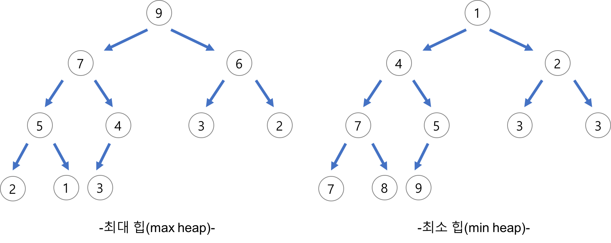
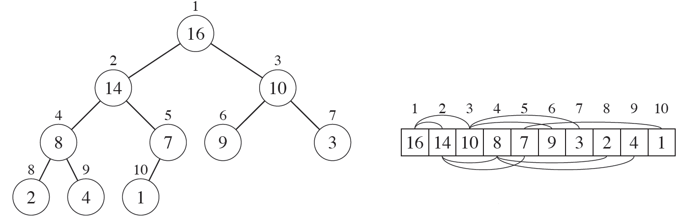
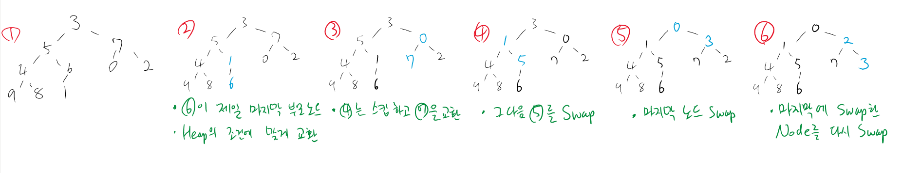
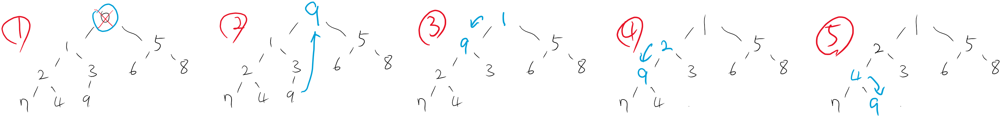
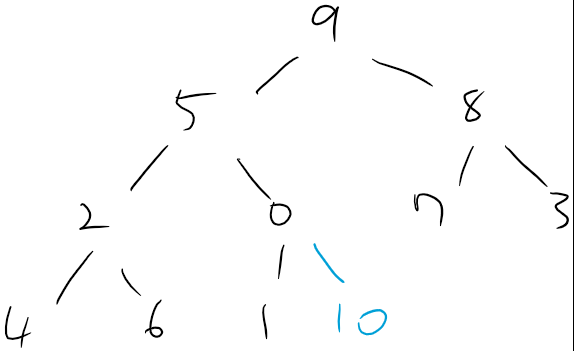
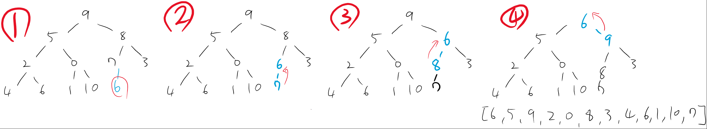

# [Algorithm] Heap 자료구조

# Heap

Heap의 자료구조는 이진 트리의 일종으로 우선순위 큐를 위한 매우 힙한(?) 구조

Heap은 가장 우선순위를 찾는데 유용하며, 또한 빠르게 가장 작은 값부터 큰 값을 찾는데 유용

한번 힙화(heapify)를 하면 가장 작거나 큰 값을 빠르게 찾는 것이 주목적이자 장점

# Heap 특징

- 항상 부모노드가 자식보다 커야함
- 이진 트리의 일종으로 우선순위 큐를 위한 자료 구조
    - 상위 하위 레벨이 있는 구조
    - 부모노드가 항상 자식보다 큰 구조를 가짐
- 여러 개의 값들 중 최댓값과 최솟값을 빨르게 찾는 다는 장점을 가짐
- 최대 힙 (Max Heap)
    - 가장 맨 위의 노드가 가장 큰 값을 가져야 함
    - 부모 노드 > 자식 노드
- 최소 힙 (Min Heap)
    - 반대로 가장 맨 위의 노드가 가장 작은 값
    - key (부모 노드) ≤ key (자식 노드)

source: [https://gmlwjd9405.github.io/2018/05/10/data-structure-heap.html](https://gmlwjd9405.github.io/2018/05/10/data-structure-heap.html)

# Heap in Array 표현

볼 때는 이진트리로 보지만, List 또는 Array로 볼 때는 아래에 우측 사진의 그림처럼 한 줄로 펼쳐서 본다. 

아래는 Max Heap 의 예시

source: [https://ratsgo.github.io/data structure&algorithm/2017/09/27/heapsort/](https://ratsgo.github.io/data%20structure&algorithm/2017/09/27/heapsort/)

    heap = [16, 14, 10, 8, 7, 9, 3, 2, 4, 1]

# heapq 모듈 사용하기

heapq에서 가장 흔히 사용 할 수 있는 method는 아래와 같다 

- heapq.heapify(heap) - 숫자 list를 heap화 한다
- heapq.heappush(heap, num) - 숫자 하나를 추가하고, 다시 재정렬
- heapq.heappop(heap) - 가장 최소 값을 return하고, 목록에선 제외
- 패키지에서는 Max Heap아닌 **Min Heap만 구현**되어있음
    - Heapify를 했으면 맨 앞의 숫자가 최소값

    # 예시 만들기 
    heap = np.arange(10)
    np.random.shuffle(heap)
    heap = heap.tolist()
    print(heap)

    # 출력결과: 예시로 하나의 행열 생성
    [3, 5, 7, 4, 6, 0, 2, 9, 8, 1]

### Module 불러오기

    # input
    import heapq

### Heapify 하기

    heapq.heapify(heap)
    print(heap)

    # 출력결과: heapify해서 재정렬된 heap
    # 가장 작은 0이 맨 앞으로 옮겨짐
    # 그 뒤에는 가능하면 작은 값이 나왔지만, 중간에 순서가 다른 건 중요치 않음
    [0, 1, 2, 4, 5, 7, 3, 9, 8, 6]

### heappop() 사용하여 최소값 뽑기

- 주의사항: heapify를 하지 않으면 최소값이 맨 앞에 없는 채 나올 수 있음

    heapq.heappop(heap)
    print(heap)

    # 출력결과: 0이 빠지고 그 다음 값이 대기 중으로 나온 것 확인
    # 자식 노드 중 더 작은 값이랑 교환하면서 내려감
    [1, 2, 5, 4, 3, 6, 8, 7, 9]

    while heap:
        smallest = heapq.heappop(heap)
        print(smallest, heap)

    # 출력결과: 앞에서 가장 작은 값이 return 한다는 것을 강조 했듯이 
    # 가장 작은 값이 return되고, 뒤에 숫자들이 재정렬이 되는 것을 확인
    1 [2, 3, 5, 4, 9, 6, 8, 7]
    2 [3, 4, 5, 7, 9, 6, 8]
    3 [4, 7, 5, 8, 9, 6]
    4 [5, 7, 6, 8, 9]
    5 [6, 7, 9, 8]
    6 [7, 8, 9]
    7 [8, 9]
    8 [9]
    9 []

결과적으로 보면 0부터 가장 작은 숫자 순서대로 나오는 것 확인

> 위와 같은 방법으로 출력하면 정렬된 Heap Sort가 되는 것이다

### heappush 사용하여 새로운 힙한(?) 숫자 추가

    # 새로운 heap이라는 새로운 목록을 만들어 다시 예시를 만들어보자
    heap = np.arange(10)
    np.random.shuffle(heap)
    heap = heap.tolist()
    heap
    
    # **출력결과**: 새로운 예제를 만들어 다시 시작
    [9, 5, 8, 2, 0, 7, 3, 4, 6, 1]

    # heap이라는 목록에 10이라는 값을 추가
    heapq.heappush(heap, 10)
    print(heap)

    # **출력결과**: 이때는 heapify가 된게 아니라 10의 자리인 빈 공간에만 찾아간다
    # 그래서 heapify한 것처럼 맨 앞에 가장 작은 0이 안 나올 수 있다
    # 10이 빈자리에 들어갔는데. 부모노드보다 크지 않으므로 변화가 없다
    [9, 5, 8, 2, 0, 7, 3, 4, 6, 1, 10]

    # heap 새로운 6을 넣어보자
    heapq.heappush(heap, 6)
    print(heap)

    # 출력결과:
    [6, 5, 9, 2, 0, 8, 3, 4, 6, 1, 10, 7]

## Max Heap

    import heapq
    
    nums = [4, 1, 7, 3, 8, 5]
    heap = []
    
    for num in nums:
      heapq.heappush(heap, (-num, num))  # (우선 순위, 값)
    
    while heap:
      print(heapq.heappop(heap)[1])  # index 1

    8
    7
    5
    4
    3
    1